🚀 Hệ Thống Microservices E-Project

Hệ thống microservices hoàn chỉnh cho ứng dụng thương mại điện tử với xác thực, quản lý sản phẩm và xử lý đơn hàng sử dụng RabbitMQ cho giao tiếp bất đồng bộ.

🌟 Kiến Trúc Hệ Thống

┌─────────────────┐    ┌──────────────────┐    ┌─────────────────┐
│   API Gateway   │    │   Auth Service   │    │ Product Service │
│    (Port 3003)  │    │    (Port 3000)   │    │   (Port 3001)   │
└─────────────────┘    └──────────────────┘    └─────────────────┘
         │                       │                       │
         └───────────────────────┼───────────────────────┘
                                 │
                     ┌───────────┴───────────┐
                     │                       │
             ┌─────────────┐         ┌─────────────┐
             │  MongoDB    │         │  RabbitMQ   │
             │ (Port 27017)│         │ (Port 5672) │
             └─────────────┘         └─────────────┘
                       │                       │
                       └───────────┬───────────┘
                                 │
                     ┌───────────┴───────────┐
                     │   Order Service       │
                     │    (Port 3002)        │
                     └───────────────────────┘
🏗️ Tổng Quan Các Dịch Vụ

Dịch Vụ	Port	Mô Tả	Database
API Gateway	3003	Định tuyến requests đến các dịch vụ	-
Auth Service	3000	Xác thực và phân quyền người dùng	auth_db
Product Service	3001	Quản lý sản phẩm và khởi tạo đơn hàng	products
Order Service	3002	Xử lý và hoàn thành đơn hàng	orders
📋 Yêu Cầu Hệ Thống

Trước khi chạy dự án, đảm bảo bạn đã cài đặt:

Node.js (phiên bản 14 hoặc cao hơn)
Docker & Docker Compose
MongoDB (tùy chọn - đã bao gồm trong Docker)
RabbitMQ (tùy chọn - đã bao gồm trong Docker)

⚙️ Cấu Hình Môi Trường

Tạo file .env trong mỗi thư mục dịch vụ:

Auth Service (.env)
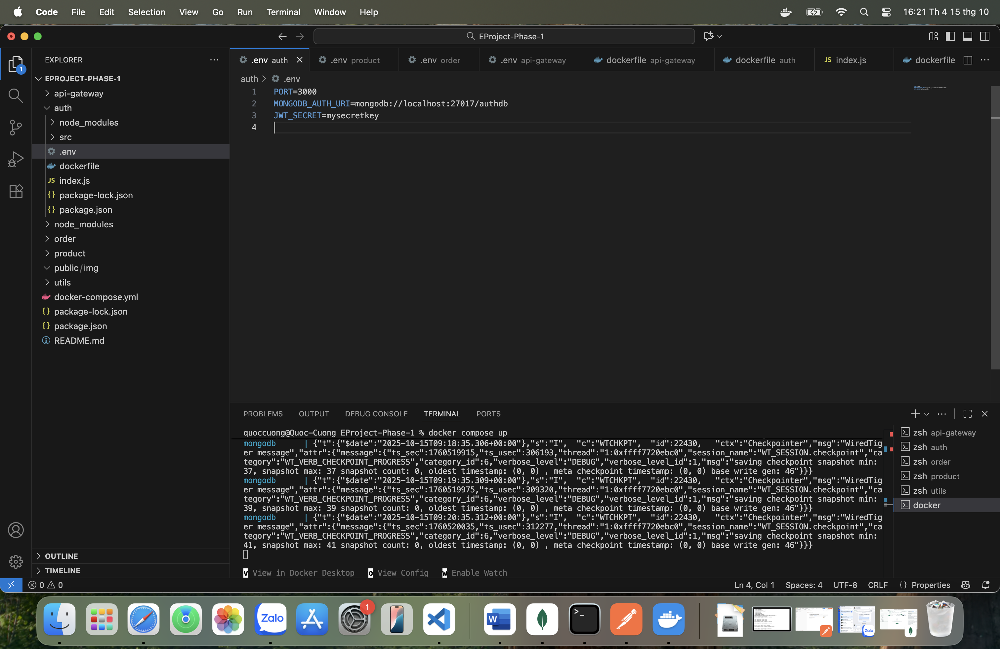

Product Service (.env)
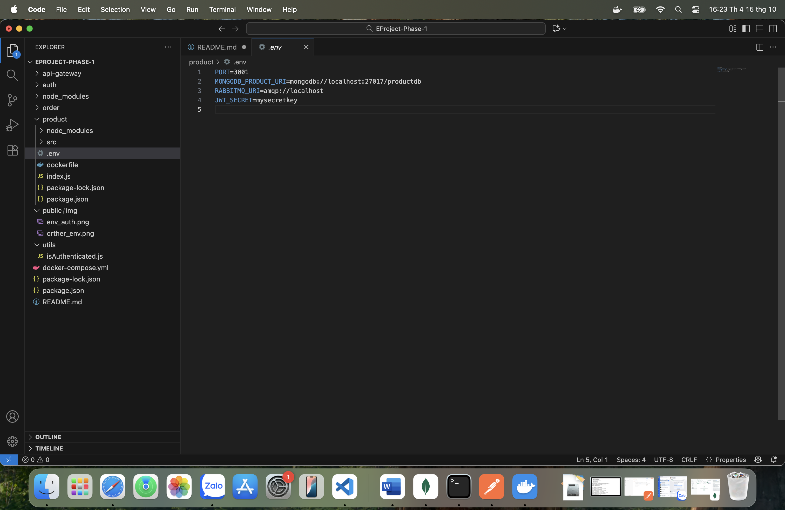

Order Service (.env)
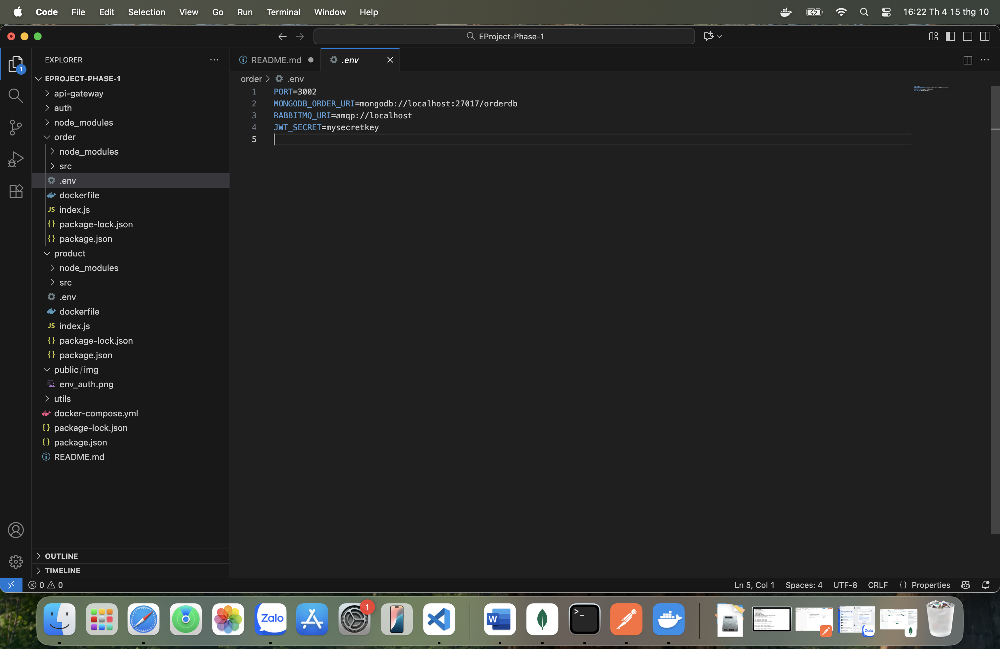

Cấu Trúc Code:

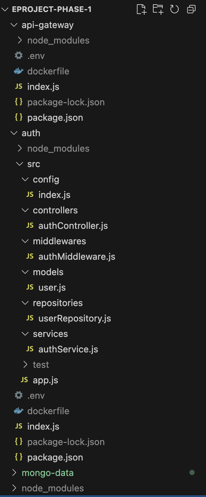
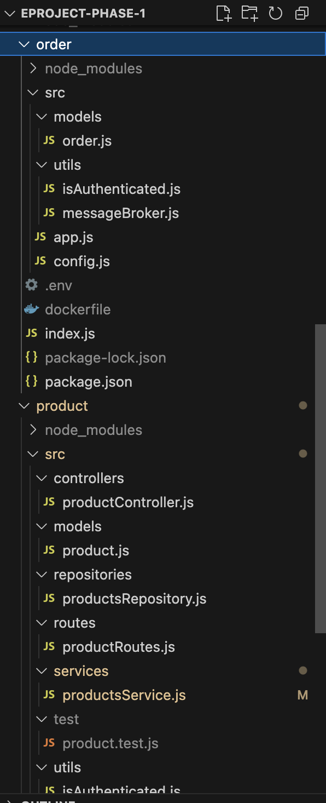
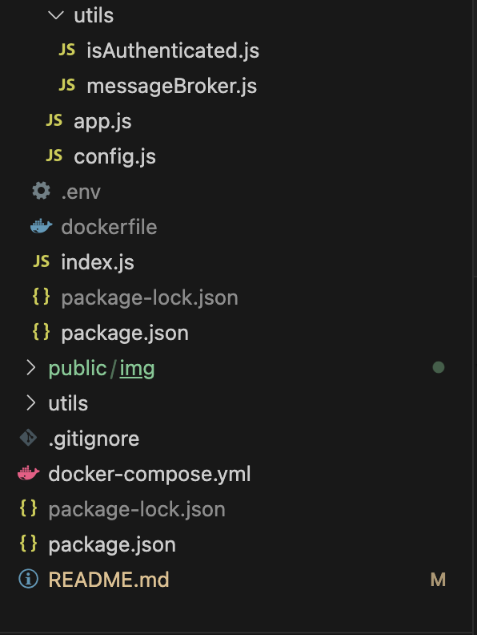

🧪 HƯỚNG DẪN TEST VỚI POSTMAN

1. 🔐 TEST DỊCH VỤ XÁC THỰC

Đăng ký người dùng mới

POST http://localhost:3003/auth/register

{
  "username": "cuong",
  "password": "123456"
}
Response thành công:

Đăng nhập

POST http://localhost:3003/auth/login

{
  "username": "cuong",
  "password": "123456"
}
Response thành công:
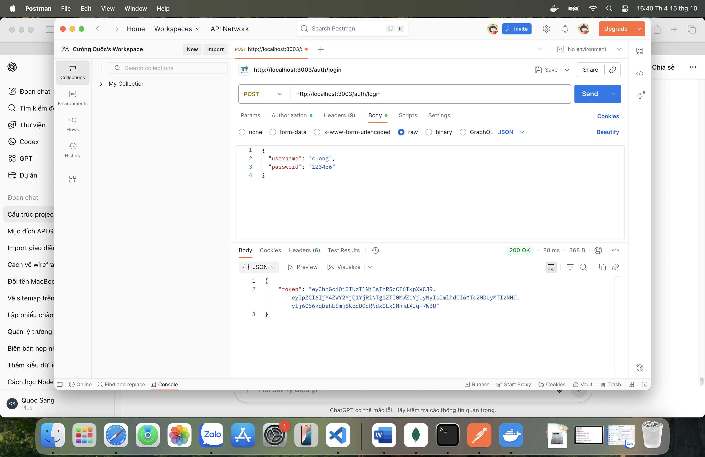

Truy cập route được bảo vệ

GET http://localhost:3003/auth/dashboard

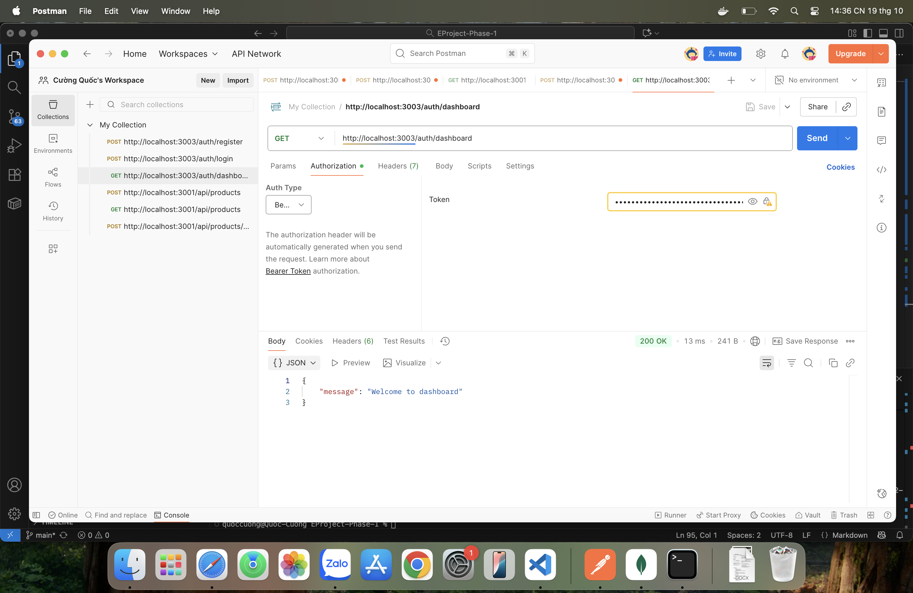

2. 📦 TEST DỊCH VỤ SẢN PHẨM

Tạo sản phẩm mới

POST http://localhost:3001/products
Content-Type: application/json

phải xác thực người dùng bằng token
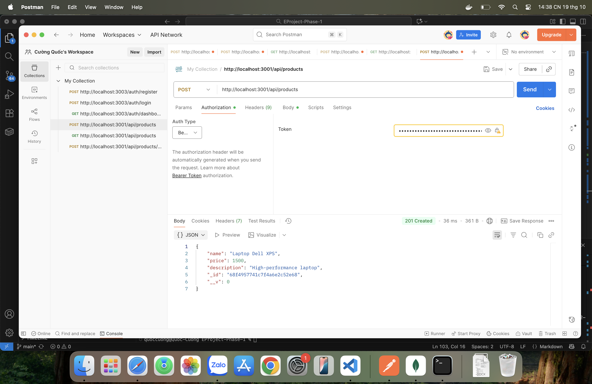

{
  "name": "Laptop Dell XPS",
  "price": 1500,
  "description": "High-performance laptop"
}
Response thành công:
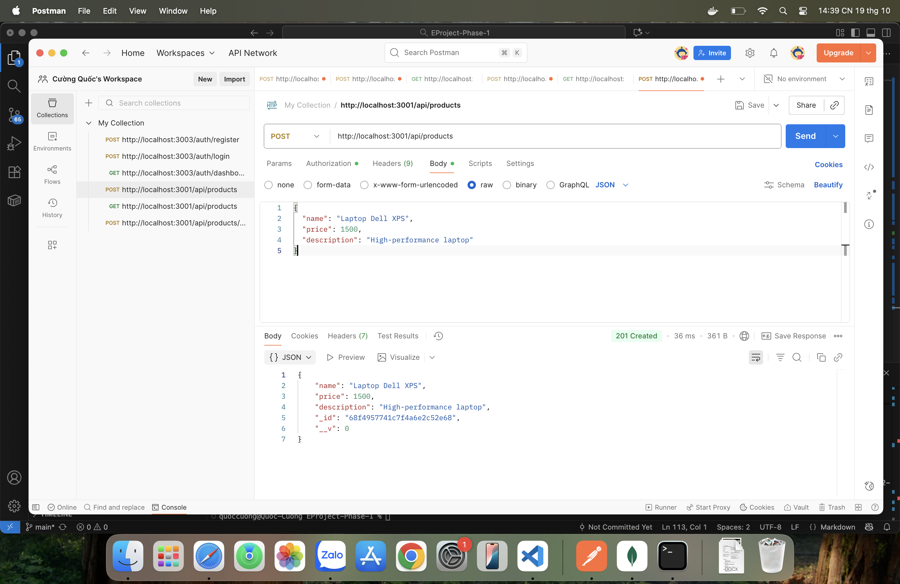

Dữ liệu được đổ vào mongoDB:
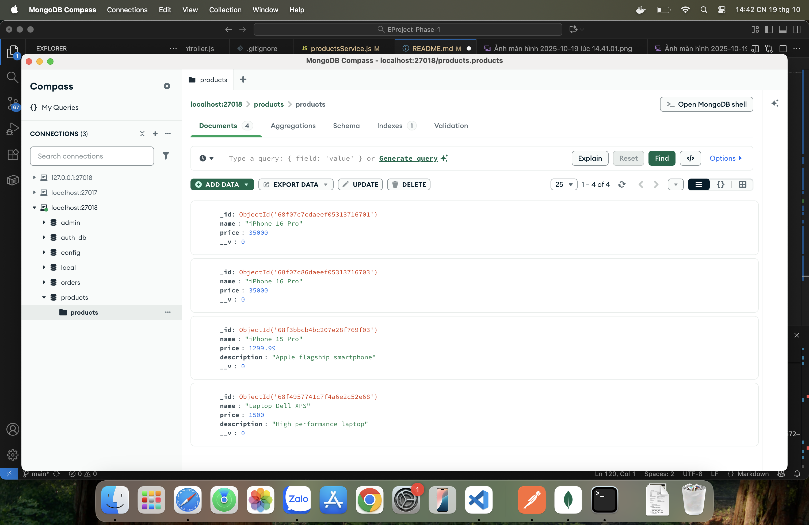

Lấy danh sách sản phẩm

GET http://localhost:3001/products

phải xác thực token người dùng 

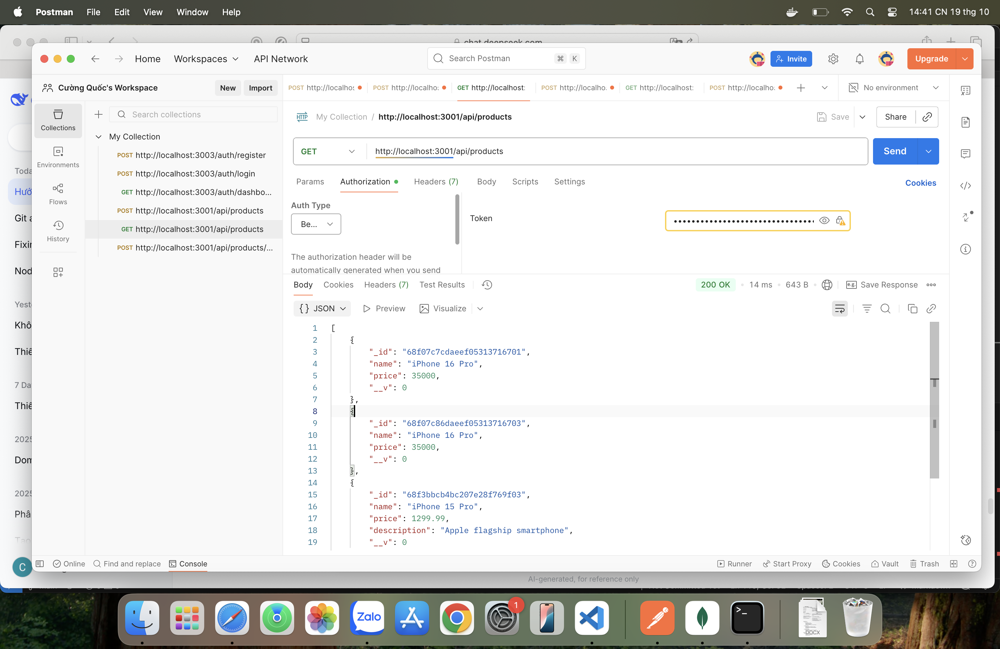

Mua hàng - Tạo đơn hàng:
POST http://localhost:3001/products/buy
Content-Type: application/json
Phải xác thực token người dùng

{
  "ids": ["68f07c7cdaeef05313716701"]
}

Response thành công (sau khi xử lý):
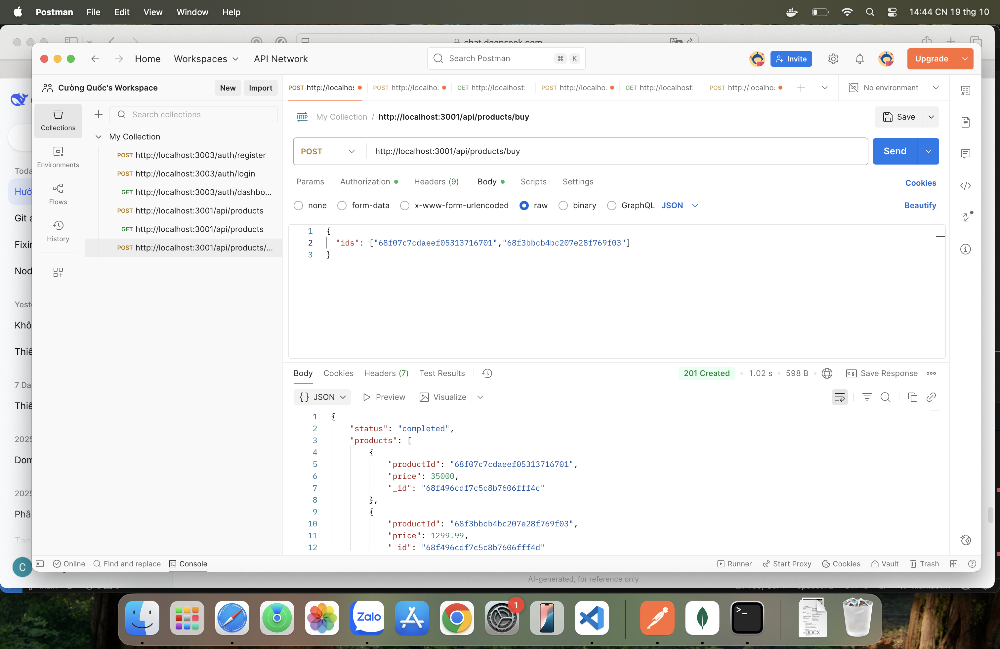

dữ liệu được đổ vào mongoDB:
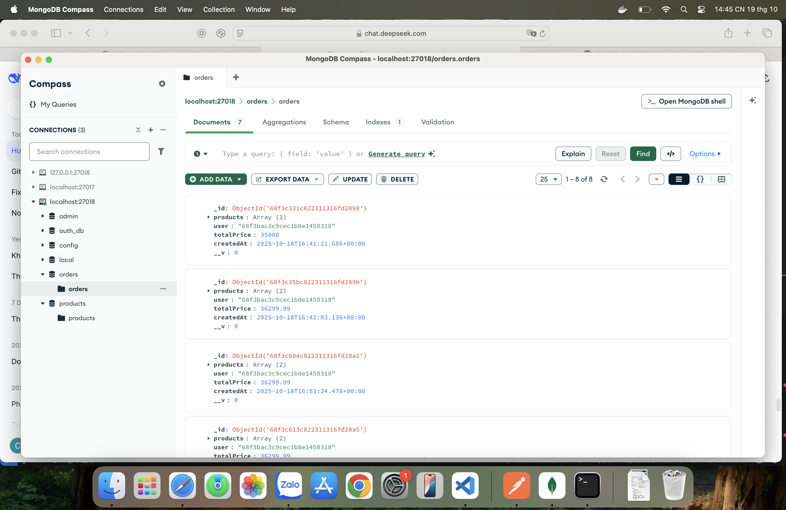
